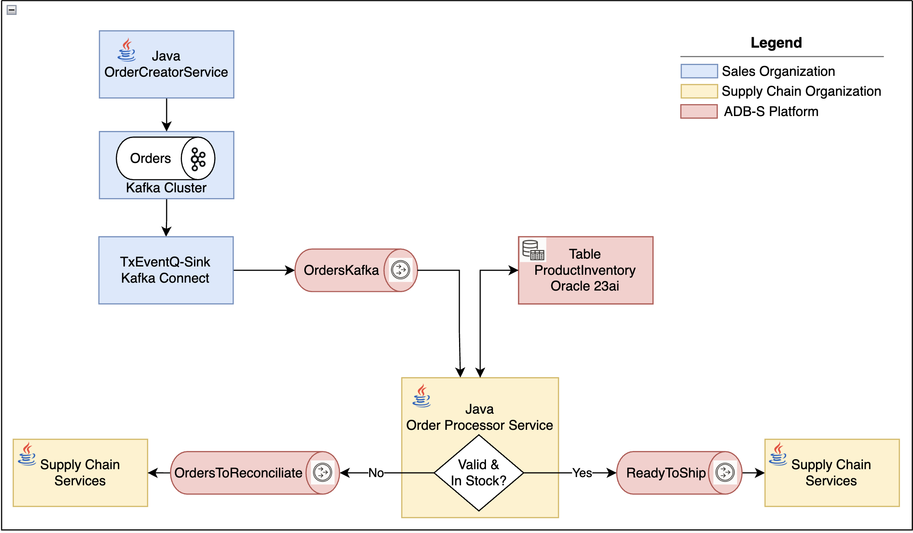

# Kafka Interoperability Sample with TxEventQ

This project demonstrates how to integrate Apache Kafka with Oracle Transactional Event Queues (TxEventQ). It provides a sample application that simulates an order processing system, showcasing the interoperability between Kafka topics and Oracle TxEventQ.

## Overview



The sample application consists of the following components:

* **Kafka Order Creator:** A service that generates sample order events and publishes them to a Kafka topic named `Orders`. ([`KafkaOrderCreatorService`](kafka-interoperability-sample/src/main/java/com/txeventq/KafkaOrderCreatorService.java))
* **Order Processor:** A service that consumes order events from the `Orders` Kafka topic, processes them, and interacts with an Oracle database to manage product inventory.
    * If sufficient stock is available, the order is processed, the inventory is updated, and an event is published to the `OrdersToShip` Kafka topic. ([`OrderProcessorService`](kafka-interoperability-sample/src/main/java/com/txeventq/OrderProcessorService.java))
    * If insufficient stock is available, the order is published to the `OrdersToReconcile` Kafka topic for reconciliation. ([`OrderProcessorService`](kafka-interoperability-sample/src/main/java/com/txeventq/OrderProcessorService.java))
* **Orders Fulfilled Consumer:** A service that consumes order events from the `OrdersToShip` Kafka topic, representing successfully fulfilled orders. ([`OrdersFulfilled`](kafka-interoperability-sample/src/main/java/com/txeventq/OrdersFulfilled.java))
* **Orders Not Fulfilled Consumer:** A service that consumes order events from the `OrdersToReconcile` Kafka topic, representing orders that could not be fulfilled due to insufficient stock. ([`OrdersNOTFulfilled`](kafka-interoperability-sample/src/main/java/com/txeventq/OrdersNOTFulfilled.java))

**Note:** You will need to replace the placeholder values in the configuration files with your actual environment settings, such as database credentials, Kafka broker addresses, and wallet paths.

## Prerequisites

* Java 17+
* Maven
* Docker (for running Kafka and Connect Cluster and Oracle database-if needed)

## Docker Compose

A `docker-compose.yml` file is provided to simplify the setup of a local Kafka cluster and Oracle database.

1. **Start the Docker containers:**

    ```bash
    docker-compose up -d
    ```

2. **Configure the application:**
    * Update the configuration files to use the Docker container addresses for Kafka and Oracle database.

3. Create database resources using the provided sql file

4. Created `Orders` topic with 3 partitions at your Kafka cluster

5. Create txeventq-sink connector at the kafka connect

6. Run the each application components