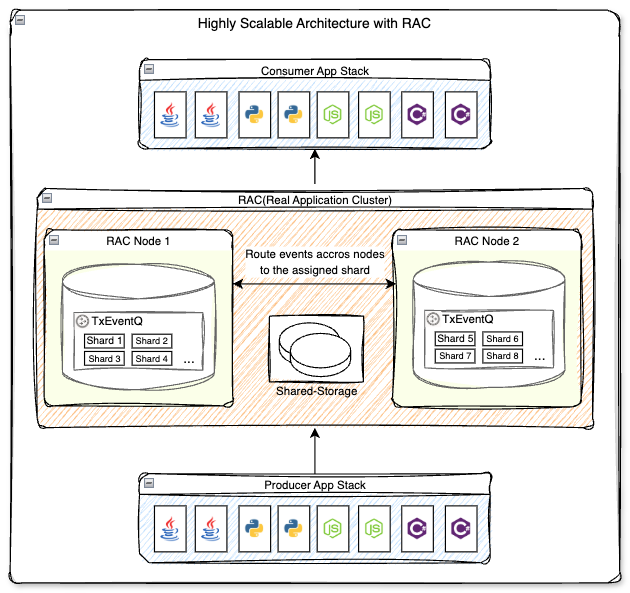
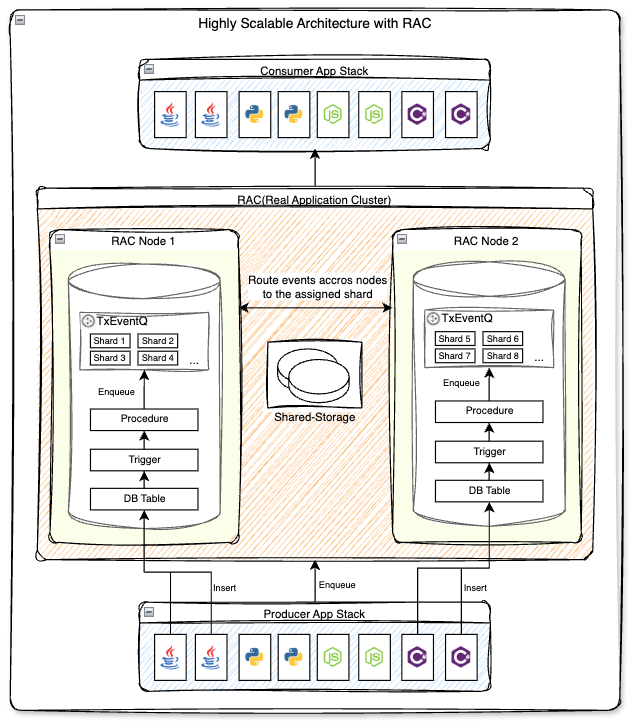

# Building Scalable Event-Driven Systems with Oracle Transactional Event Queue (TxEventQ) on Real Application Cluster (RAC)

## Introduction

Oracle **TxEventQ** brings powerful event-streaming and messaging capabilities directly into the Oracle Database. It is a messaging broker system built into the database itself, meaning you don’t need to provision or manage extra infrastructure, set up separate security. If you have Oracle Database, you already have a highly scalable, transactional, event-driven messaging system ready to use at no cost.  

Because TxEventQ runs inside the database, it inherits Oracle’s proven strengths:  

- **Security**: unified with database authentication, encryption in-transit and at-rest. No additional steps needed as you already have it configured at your Oracle db.
- **Performance**: many options to scale.
- **Cost efficiency**: no need for separate brokers or clusters, you do not need another system to persist streaming data if needed.
- **Interoperability**: tight integration with PL/SQL, and multiple language SDKs. Kafka-compatible APIs and connectors to integrate with other messaging platforms.  
- **Transactional consistency**: ACID transactions, exactly-once delivery, and database persistence.
- **Monitoring**: use existing tools already setup for your database or Grafana, APM tools.  

With these capabilities, TxEventQ enables enterprises to build **scalable event-driven systems and real-time streaming architectures**, modern highly scalable and highly available systems.

This blog will help you understand how TxEventQ supports building **highly scalable event-driven systems on RAC**. We’ll show how events flow end-to-end, how features like **`KEY_BASED_ENQUEUE`** and **`STICKY_DEQUEUE`** guarantee strict ordering, and how this model extends to support modern highly scalable and available applications.

---

## Use Case: Insurance Claim Event Processing

Many systems begin with a single database instance. This may be enough at first, but as traffic grows and event volumes increase, the need to scale horizontally becomes inevitable. With Oracle RAC, you can add new nodes to handle load, spreading connections and storage while preserving high availability. TxEventQ is designed to take advantage of this — scaling seamlessly across RAC nodes while guaranteeing ordering and ACID.

When Oracle Database is deployed on RAC, producers connect to whichever node is available. Some applications may send events directly to TxEventQ; others, as other systems, may simply insert rows into tables. Either way, TxEventQ helps you to ensure these events are routed correctly, processed in order, and consumed reliably.  

**Shards and Owner Instances**  
A TxEventQ is divided into multiple shards, which are partitioned segments of the queue’s storage — conceptually similar to Apache Kafka partitions. Each shard is “owned” by a specific RAC node, and that ownership determines where messages for the shard are stored and consumed. Each shard is “owned” by a specific RAC node. When the system publishes an event, it hashes the event’s correlation ID (the unique message identifier, called claim ID in this use case) to determine the target shard. TxEventQ then delivers the event to the shard’s owning node, even if a different RAC node produced it.

Let’s put this into context with an insurance claim system. Imagine an application where a claim is created, an adjuster inspects the damage, additional updates are entered, and finally the claim is either approved or rejected. Each of these actions generates an event, and all of them share the same claim ID.  



1. **Producers** (applications or triggers/procedures) publish events with a correlation ID.  
2. **TxEventQ** evaluates the correlation ID, applies hashing, and assigns the event to a shard.
3. If the event arrives at a RAC node that doesn’t own the shard, Oracle’s RAC-aware internal technology transparently forwards the event to the node that owns the shard.  
4. **Consumers** subscribe to the queue. With sticky dequeue enabled, each subscriber session is tied to a shard, ensuring events are always consumed in order.  

Now let’s look at the two key features that make this work.  

---

### Key-Based Enqueuing

When creating a TxEventQ, configure it with **`KEY_BASED_ENQUEUE=TRUE`**.  

- Each event includes a **correlation ID** (for example, a claim ID).  
- TxEventQ computes a **hash** of the correlation ID.  
- The hash consistently maps that key to a specific shard.  
- If a producer is connected to RAC Node 2, but the shard owner is RAC Node 1, TxEventQ automatically ensures the event is delivered to the correct shard at RAC Node 1.  

This guarantees that **all events for the same correlation ID are routed to the same shard** — regardless of where they are produced. Without key-based enqueuing, events are distributed round-robin to shards, however, ordering is not guaranteed.  

Code Sample:

```sql
    DBMS_AQADM.set_queue_parameter('ClaimUpdatesTopic', 'KEY_BASED_ENQUEUE', 1);
```

---

### Sticky Dequeue

On the consumer side, TxEventQ normally uses *hungry consumer mode*: any available subscriber session can pull from any shard. While efficient, it does not preserve ordering.  

With **`STICKY_DEQUEUE=TRUE`**:  

- Each subscriber session binds to one or more shards.  
- All messages from a shard are processed by the same subscriber session, preserving order end-to-end.  

Please note that if you are using Oracle Db version 19.27 or below:

*Subscriber sessions(consumers) map 1:1 with shards. Example, if you have 16 shards, you must provision 16 subscriber sessions. Otherwise, some shards will not have a subscriber session to consume events. We suggest that you upgrade to the latest version.*

Code Sample:

```sql
    DBMS_AQADM.set_queue_parameter('ClaimUpdatesTopic', 'STICKY_DEQUEUE', 1);
```

---

With **`KEY_BASED_ENQUEUE`**, all of these claim events are hashed to the same shard, regardless of which RAC node the producer application connects to. With **`STICKY_DEQUEUE`**, a subscriber session tied to that shard processes them in the exact order they occurred.  

This strict ordering is critical. If the approval event were processed before the inspection event, it could lead to inconsistent business logic or even trigger fraud-detection systems unnecessarily.  

You can also implement this system on an architecture where applications insert records into a database table, and a trigger with a procedure publishes those records to TxEventQ. As shown here:



---

## Conclusion

TxEventQ scales naturally with RAC. As new nodes are added, shards are distributed, producers continue to connect transparently, and ordering guarantees are maintained. Unlike external brokers, there’s no need to provision and manage separate systems — TxEventQ leverages Oracle Database’s native clustering, security, and storage.  

The result is a **horizontally scalable, highly available event-streaming system**, with the ordering and transactional guarantees that modern applications require built right into your Oracle Database.  

By combining **`KEY_BASED_ENQUEUE`** with **`STICKY_DEQUEUE`**, it guarantees strict per-key ordering across RAC nodes on-premise or on-cloud. In this example, it unifies all event sources into a single, consistent platform supporting various programming languages and patterns.

---

## Code Examples

link here...
