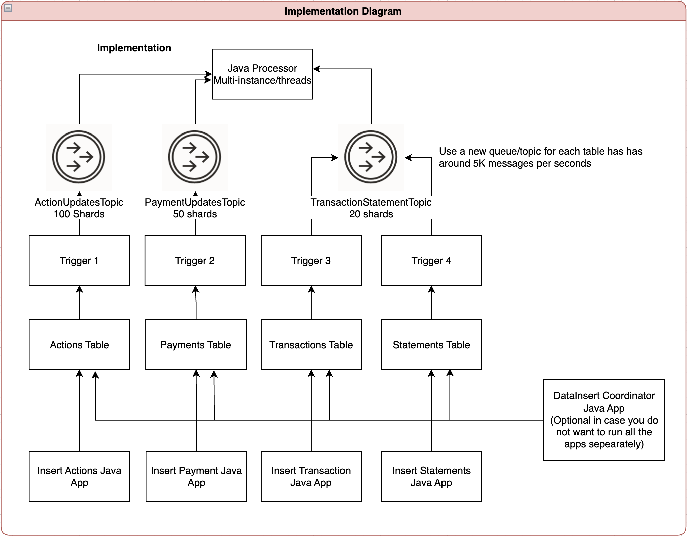

# Oracle TxEventQ Sample Project - Source Events From Table into TxEventQ Topic(near-realtime)

## Overview

This Proof of Concept (POC) demonstrates a **data pipeline architecture** using Oracle TxEventQ (Transaction Event Queues) for real-time data processing and analytics integration. The solution addresses the common enterprise requirement of:

- **Capturing Data Changes**: Automatically detect INSERT/UPDATE operations on business tables
- **Event Streaming**: Route data changes to TxEventQ topics for real-time processing
- **Resource Optimization**: Minimize database resource consumption through efficient data handling
- **Analytics Integration**: Enable external analytics applications to consume processed events

## Business Use Case

This POC simulates a typical enterprise scenario where:

1. **Source Systems** insert/update data in various business tables
2. **TxEventQ Pipeline** captures these changes and streams them to dedicated topics
3. **Processing Application** consumes events and performs business logic
4. **Analytics Integration** forwards processed data to external analytics systems

The key requirement is to **minimize database resource consumption** while maintaining high throughput and ensuring data is not duplicated unnecessarily.

## Architecture



### Data Pipeline Flow

```
Source Systems → Business Tables → Database Triggers → TxEventQ Topics → Processing App → Analytics Systems
```

### Components

1. **Data Insert Coordinator** (`DataInsertCoordinator`)
   - **Purpose**: Simulates source systems inserting data into business tables
   - **Functionality**: Inserts test data into 4 different business tables (Action, Payment, Statement, Transaction)
   - **Features**: Supports both parallel and sequential execution modes
   - **Usage**: Single command to insert specified number of records across all tables

2. **Event Consumer Application** (`EventConsumerApp`)
   - **Purpose**: Processes real-time events from TxEventQ topics
   - **Functionality**: Consumes events from multiple subscribers simultaneously
   - **Features**: Configurable threading, error handling, and performance monitoring
   - **Output**: Processes events and prepares them for external analytics systems

3. **Database Layer**
   - **Business Tables**: Store actual business data (ActionUpdatesTable, PaymentUpdatesTable, etc.)
   - **TxEventQ Topics**: Sharded queues for high-throughput event streaming
   - **Database Triggers**: Automatically enqueue events when data changes
   - **Subscribers**: Consumer endpoints for message processing

### Event Types & Topics

| Event Type | Business Table | TxEventQ Topic | Subscriber | Purpose |
|------------|----------------|----------------|------------|---------|
| **Action** | `ActionUpdatesTable` | `ActionUpdatesTopic` | `ActionUpdatesSubscriber1` | Action-related business events |
| **Payment** | `PaymentUpdatesTable` | `PaymentUpdatesTopic` | `PaymentUpdatesSubscriber1` | Payment processing events |
| **Statement** | `StatementsUpdatesTable` | `TransactionStatementTopic` | `StatementsUpdatesSubscriber1` | Financial statement events |
| **Transaction** | `TransactionUpdatesTable` | `TransactionStatementTopic` | `StatementsUpdatesSubscriber1` | Transaction events |

## Performance Best Practices

### ⚠️ **Critical Recommendation: Topic Separation**

**For high-volume tables (>5,000 messages/second):**

- **Create separate TxEventQ topics** for each high-volume table
- **Do NOT combine multiple tables** into a single topic
- **Recommended limit**: Maximum 5,000 messages/second per topic
- **Benefits**: Better performance, easier monitoring, and reduced resource contention

### Resource Optimization

1. **Minimal Database Impact**
   - Database triggers are lightweight and efficient
   - No polling or batch processing required
   - Automatic event generation on data changes

2. **Memory Efficiency**
   - Batch processing with 5,000 records per batch
   - Connection pooling for database operations
   - Configurable consumer threading

3. **Storage Management**
   - Events are automatically dequeued after processing
   - No data duplication in business tables
   - Efficient sharded queue architecture

## Prerequisites

### Software Requirements

- **Java 23** (as specified in pom.xml)
- **Maven 3.6+**
- **Oracle Database 19c** with TxEventQ support

### Database Setup

1. **Database User**: Create a user with appropriate privileges (see Required Privileges below)
2. **TNS Configuration**: Configure your TNS names for database connectivity
3. **Wallet Setup**: If using wallet-based authentication, configure your Oracle wallet

### Required Privileges

The database user needs:

- `CREATE TABLE` privilege
- `CREATE PROCEDURE` privilege  
- `CREATE TRIGGER` privilege
- `DBMS_AQADM` package access
- `SYS.AQ$_JMS_TEXT_MESSAGE` access

## Installation & Setup

### 1. Clone and Build

```bash
git clone <repository-url>
cd source-events-from-table-19c
mvn clean compile
```

### 2. Configure Database Connection

**IMPORTANT**: Update the database connection settings in `src/main/java/com/oracle/osd/utils/DatabaseUtils.java`:

```java
private static final String URL = "replace_me_url";
private static final String USERNAME = "replace_me_username";
private static final String PASSWORD = "replace_me_password";
```

**Required Replacements:**

- **`replace_me_url`**: Replace with your Oracle database connection string
  - Example: `"jdbc:oracle:thin:@your_tns_name?TNS_ADMIN=/path/to/your/wallet"`
  - Or: `"jdbc:oracle:thin:@//hostname:port/service_name"`
- **`replace_me_username`**: Replace with your Oracle database username
- **`replace_me_password`**: Replace with your Oracle database password

**Configuration Examples:**

- **TNS Name**: `"jdbc:oracle:thin:@your_tns_name?TNS_ADMIN=/path/to/your/wallet"`
- **Direct Connection**: `"jdbc:oracle:thin:@//hostname:1521/service_name"`
- **Cloud Connection**: `"jdbc:oracle:thin:@//your-cloud-host:1521/your_service_name"`

### 3. Database Schema Setup

**Prerequisite**: Ensure you have a database user/schema named `TXEVENTQ_ADMIN` with the required privileges (see Required Privileges section above). The analysis scripts require this schema to be present.

Execute the SQL scripts in order to create the complete data pipeline:

```bash
# Action events setup
sqlplus your_user@your_tns_name @src/main/resources/resources/action-sql-resource.sql

# Payment events setup  
sqlplus your_user@your_tns_name @src/main/resources/resources/payment-sql-resource.sql

# Statement events setup
sqlplus your_user@your_tns_name @src/main/resources/resources/statement-sql-resource.sql

# Transaction events setup
sqlplus your_user@your_tns_name @src/main/resources/resources/transactions-sql-resource.sql
```

### 4. Configuration

Update `src/main/resources/consumer-config.properties` if needed:

```properties
# Threading Configuration
consumer.threads=9

# Message Consumption Configuration  
consumer.receive.timeout.ms=1000

# Queue and Subscriber Configurations
consumer.action.queue=ActionUpdatesTopic
consumer.action.subscriber=ActionUpdatesSubscriber1
consumer.payment.queue=PaymentUpdatesTopic
consumer.payment.subscriber=PaymentUpdatesSubscriber1
consumer.statement.queue=TransactionStatementTopic
consumer.statement.subscriber=StatementsUpdatesSubscriber1

# Error handling
consumer.error.retry.delay.seconds=2
consumer.shutdown.timeout.seconds=10
```

## Usage

### 1. Start the Event Consumer (Processing Application)

```bash
mvn exec:java -Dexec.mainClass="com.oracle.osd.EventConsumerApp"
```

The consumer will:

- Connect to all TxEventQ subscribers
- Process events in real-time as they arrive
- Log detailed event information for monitoring
- Handle errors gracefully with retry logic
- Prepare data for external analytics systems

### 2. Generate Test Data (Simulate Source Systems)

#### Coordinated Data Generation (Recommended)

The `DataInsertCoordinator` provides a single command to insert data across all business tables:

```bash
# Insert 1000 records into each of the 4 tables (4000 total records) in parallel
mvn exec:java -Dexec.mainClass="com.oracle.osd.DataInsertCoordinator" -Dexec.args="1000 parallel"

# Insert 500 records into each table (2000 total records) sequentially  
mvn exec:java -Dexec.mainClass="com.oracle.osd.DataInsertCoordinator" -Dexec.args="500 sequential"

# Interactive mode - will prompt for number of records
mvn exec:java -Dexec.mainClass="com.oracle.osd.DataInsertCoordinator"
```

#### Individual Table Data Generation

For testing specific event types:

```bash
# Insert action records only
mvn exec:java -Dexec.mainClass="com.oracle.osd.InsertActionRecords" -Dexec.args="1000"

# Insert payment records only
mvn exec:java -Dexec.mainClass="com.oracle.osd.InsertPaymentRecords" -Dexec.args="1000"

# Insert statement records only
mvn exec:java -Dexec.mainClass="com.oracle.osd.InsertStatementRecords" -Dexec.args="1000"

# Insert transaction records only
mvn exec:java -Dexec.mainClass="com.oracle.osd.InsertTransactionRecords" -Dexec.args="1000"
```

## Analysis Scripts

The POC includes several analysis scripts to help you understand system performance and resource usage:

### 1. Subscriber Analysis

**File**: `src/main/resources/analysis-scripts/subscriber-analysis.sql`

**Purpose**: Shows message processing statistics for each subscriber

**What it displays:**

- Queue name and subscriber name
- Number of messages enqueued
- Number of messages dequeued
- Current backlog (enqueued - dequeued)

**How to run:**

```sql
@src/main/resources/analysis-scripts/subscriber-analysis.sql
```

**Sample Output:**

```
QUEUE_NAME                    CONSUMER_NAME              ENQUEUED_MSGS DEQUEUED_MSGS    Backlog
------------------------------ -------------------------- ------------- ------------- ----------
ActionUpdatesTopic           ActionUpdatesSubscriber1           1000           950         50
PaymentUpdatesTopic          PaymentUpdatesSubscriber1          1000          1000          0
TransactionStatementTopic    StatementsUpdatesSubscriber1       2000          1950         50
```

### 2. TxEventQ Space Analysis

**File**: `src/main/resources/analysis-scripts/txeventq-space-analysis.sql`

**Purpose**: Detailed analysis of queue storage usage and space consumption

**What it displays:**

- Storage breakdown by component (Queue Table, Dequeue Log, Time Manager, etc.)
- Space usage in MB, blocks, and extents
- Partition mapping and distribution
- Total storage consumption per queue

**How to run:**

```sql
@src/main/resources/analysis-scripts/txeventq-space-analysis.sql
```

**Key Metrics:**

- **QT (Queue Table)**: Main message storage
- **DL (Dequeue Log)**: Tracks consumed messages
- **TM (Time Manager)**: Scheduling and expiration
- **EV (Eviction)**: Memory-evicted records

#### Detailed Analytics Results

The TxEventQ Space Analysis provides comprehensive insights into how Oracle TxEventQ manages storage across different components. Here's what each section means:

**Main Storage Components:**

1. **Queue Table (QT)**
   - **Purpose**: Primary storage for all queued messages
   - **What it shows**: Total space used by message data
   - **Analysis**: Higher values indicate more messages in queue

2. **Queue Table Index (QT Index)**
   - **Purpose**: Indexes for fast message retrieval and ordering
   - **What it shows**: Space used by sequence number and other indexes
   - **Analysis**: Should be proportional to queue table size

3. **Queue Table LOB (QT LOB)**
   - **Purpose**: Large Object storage for messages with large payloads
   - **What it shows**: Space used by large message content
   - **Analysis**: High values indicate many large messages

4. **Queue Table LOB Index (QT LOB Index)**
   - **Purpose**: Indexes for LOB data access
   - **What it shows**: Index space for large message retrieval
   - **Analysis**: Should correlate with LOB usage

5. **Dequeue Log (DL)**
   - **Purpose**: Tracks which messages have been consumed by subscribers
   - **What it shows**: Space used to maintain consumption history
   - **Analysis**: Grows as messages are processed

6. **Dequeue Log Index (DL Index)**
   - **Purpose**: Indexes for fast dequeue log lookups
   - **What it shows**: Index space for consumption tracking
   - **Analysis**: Should be proportional to dequeue log size

7. **Time Manager (TM)**
   - **Purpose**: Handles message scheduling and expiration
   - **What it shows**: Space for time-based message management
   - **Analysis**: Higher values indicate complex scheduling

8. **Time Manager Index (TM Index)**
   - **Purpose**: Indexes for time-based operations
   - **What it shows**: Index space for scheduling operations
   - **Analysis**: Should correlate with time manager usage

9. **Eviction (EV)**
   - **Purpose**: Memory-evicted message storage
   - **What it shows**: Space for messages moved out of memory
   - **Analysis**: High values indicate memory pressure

10. **Eviction LOB (EV LOB)**
    - **Purpose**: Large Object storage for evicted messages
    - **What it shows**: Space for large evicted messages
    - **Analysis**: Correlates with eviction and message size

**Partition Analysis:**

The script also analyzes partition distribution:

- **Mapped QT**: Active partitions currently in use
- **Unmapped QT**: Partitions not currently assigned
- **Missing QT**: Partitions that should exist but don't
- **Mapped DL**: Active dequeue log partitions
- **Unmapped DL**: Unused dequeue log partitions
- **Missing DL**: Missing dequeue log partitions

**Sample Output Interpretation:**

```
*******************************************************************************
TXEVENTQ_ADMIN.ActionUpdatesTopic
===============================================================================
table type           size (MB)        blocks        extents
-------------------------------------------------------------------------------
QT                          25           3200            40
QT Index                     5            640             8
QT LOB                       0              0             0
QT LOB Index                 0              0             0
DL (_L)                     15           1920            24
DL Index (_L)                3            384             4
TM (_T)                      2            256             3
TM Index (_T)                1            128             2
EV (_X)                      0              0             0
EV LOB (_X)                  0              0             0
-------------------------------------------------------------------------------
Total size                  51           6528            81
===============================================================================
part type        PartCount    size (MB)        blocks        extents
-------------------------------------------------------------------------------
Mapped QT              50           25           3200            40
Unmapped QT             0            0              0             0
Missing QT              0            0              0             0
Mapped DL              50           15           1920            24
Unmapped DL             0            0              0             0
Missing DL               0            0              0             0
===============================================================================
```

**Key Insights from This Example:**

1. **Total Storage**: 51 MB used across all components
2. **Queue Table**: 25 MB (49% of total) - healthy message storage
3. **Dequeue Log**: 15 MB (29% of total) - good consumption tracking
4. **No LOB Usage**: 0 MB - all messages are small/standard size
5. **No Eviction**: 0 MB - no memory pressure
6. **Partition Health**: All 50 partitions are mapped and active
7. **Storage Efficiency**: Good balance between storage and processing overhead

### 3. Check Undequeued Events

**File**: `src/main/resources/check-undequeued-events.sql`

**Purpose**: Identifies messages that haven't been processed yet

**What it displays:**

- Messages still in the queue waiting to be consumed
- Message details and timestamps
- Queue depth and processing status

**How to run:**

```sql
@src/main/resources/check-undequeued-events.sql
```

### Understanding the Analysis Results

#### Resource Usage Calculation

1. **Total Messages Processed**: Sum of all dequeued messages across subscribers
2. **Processing Rate**: Messages per second based on time elapsed
3. **Storage Efficiency**: Space used vs. messages processed
4. **Queue Health**: Low backlog indicates healthy processing

## Data Flow Architecture

### 1. Data Insertion (Source Systems)

```
Business Application → Oracle Table → Database Trigger → TxEventQ Enqueue
```

### 2. Event Processing (Analytics Pipeline)

```
TxEventQ Topic → JMS Consumer → JSON Parsing → Event Validation → Business Logic → External Analytics
```

### 3. Message Format

Events are JSON messages with the following structure:

**Action Event:**

```json
{
  "ActionId": "12345",
  "Notes": "Action entry: 1, Timestamp: 1703123456789, for action: 12345",
  "Timestamp": "1703123456789",
  "Action": "INSERT"
}
```

**Payment Event:**

```json
{
  "PaymentId": "67890", 
  "Notes": "Payment entry: 1, Timestamp: 1703123456789, for payment: 67890",
  "Timestamp": "1703123456789",
  "Action": "INSERT"
}
```

### Rollback Scripts

If you need to clean up the database:

```bash
sqlplus your_user@your_tns_name @src/main/resources/resources/rollbacks/action-rollback.sql
sqlplus your_user@your_tns_name @src/main/resources/resources/rollbacks/payment-rollback.sql
sqlplus your_user@your_tns_name @src/main/resources/resources/rollbacks/statement-rollback.sql
sqlplus your_user@your_tns_name @src/main/resources/resources/rollbacks/transactions-rollback.sql
```
